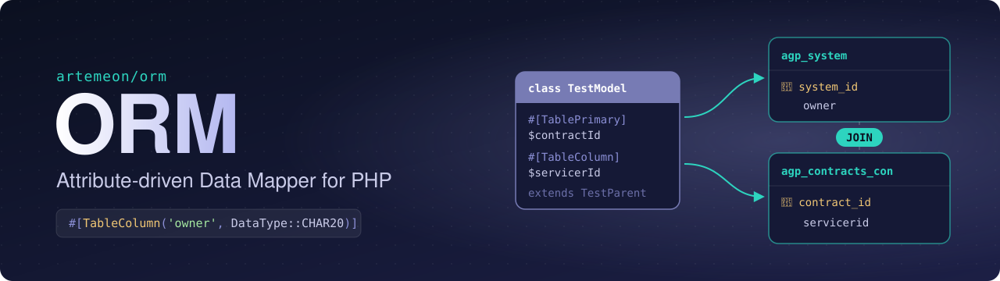

<p align="center">
  
</p>

<p align="center">
  <a href="https://github.com/artemeon/orm/actions/workflows/tests.yml"></a>
  <a href="https://github.com/artemeon/orm/actions/workflows/phpstan.yml"></a>
  <a href="https://packagist.org/packages/artemeon/orm"></a>
  = 8.4">
  <a href="LICENSE"></a>
</p>

This repository contains the ORM of the AGP platform. It is extracted from the internal ORM into a general ORM which
can be also used in other projects. It is still a work-in-progress but the idea is to eventually replace the AGP
internal ORM.

## Ideas

The main idea behind the ORM is really simple, basically you can attach to your entity `TableColumn` attributes and
based on those attributes the ORM builds the table structure. It has a special inheritance handling so that every parent
will have its own table. The ORM then automatically joins those tables on select.

```php
#[TableName('contracts')]
class TestModel extends TestParent
{
    #[TablePrimary('contract_id')]
    private string $contractId;

    #[TableColumn('servicerid', DataType::CHAR20)]
    private $strServicerId;

    #[TableColumn('inhouseservice', DataType::INT)]
    private $intInhouseService;

    #[TableColumn('outsourcing_i', DataType::CHAR20)]
    private ?string $outsourcingInstitution = null;

    #[TableColumn('purchasing_relevance', DataType::INT)]
    private ?int $purchasingRelevance = 0;

    // getter/setter
}

#[TableName('entities')]
class TestParent implements EntityInterface
{
    #[TablePrimary('system_id')]
    private string $systemId;

    #[TableColumn('owner', DataType::CHAR20)]
    private ?string $owner = null;

    // getter/setter
}

```

Those entity classes would generate two tables `entities` and `contracts` with the fitting columns.

## Design

This ORM follows the Data-Mapper Pattern, this means your entities are simple PHP classes where you only define the
properties and getter/setter, your entity does not contain any business logic. To CRUD an entity you need to use the
`EntityManager`.

## Goals

### Root is not required

Currently every entity must extend from the `Root` entity which maps to the `agp_system` table. This means that every
entity has an entry in the `agp_system` table, because of this the `agp_system` table becomes really large. With this
ORM we have the possibility to create an entity without extending from the `Root` entity, this brings us more
flexibility and in the end also better performance.

### Compatibility

We try to use this ORM as drop-in replacement for the current ORM, so that we dont need to change the logic of each
model. In the future we might also completely change the ORM but this should be a second step.

### Improved column options

Currently we have not the option to specify a column length, the length is integrated in the data type. This should
provide a way to set custom length for a column.
